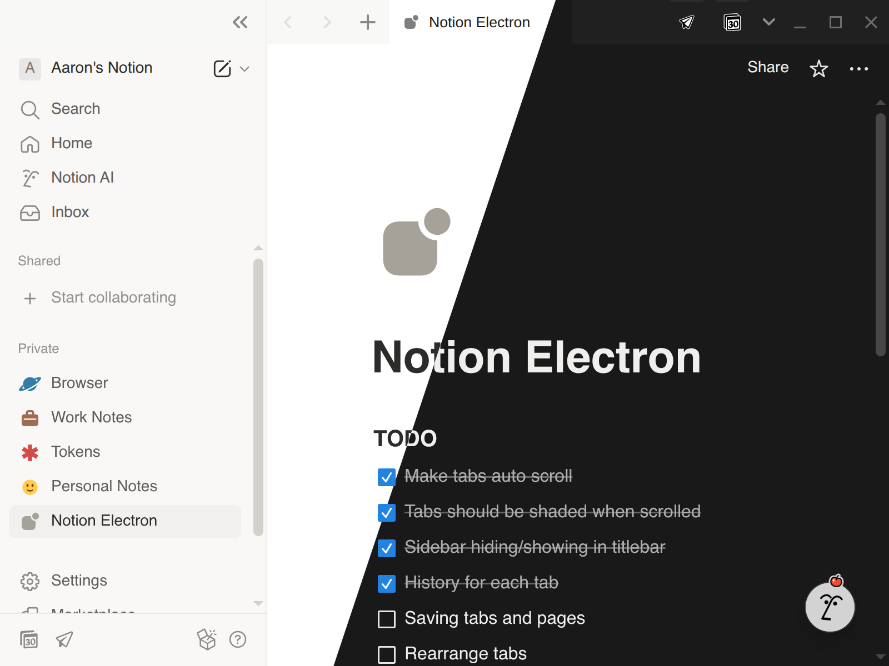

# <sub><picture><source media="(prefers-color-scheme: dark)" srcset="assets/logo-small-light.svg"><source media="(prefers-color-scheme: light)" srcset="assets/logo-small-dark.svg"></picture></sub> Notion Electron – Unofficial Notion Client for Linux

Notion Electron is an unofficial desktop application for Notion, built using Electron. This project aims to provide a seamless and native-like experience for Notion users on desktop Linux (tested on Fedora 43). Fully functional clients for Notion Calendar and Notion Mail included as dedicated tabs.

> [!NOTE]
> 🎉 Thank you all for your amazing support — the app has already been downloaded **over 10,000 times**! If you enjoy using it, please consider leaving a ⭐ on the repository — it really motivates to continue the work and means a lot!

[](https://deepwiki.com/anechunaev/notion-electron)

<picture>
	<source media="(prefers-color-scheme: dark)" srcset="docs/screenshot_dark.png">
	<source media="(prefers-color-scheme: light)" srcset="docs/screenshot_light.png">
	
</picture>

## Installation

<a href="https://github.com/anechunaev/notion-electron/releases/download/v1.9.2/notion-electron-1.9.2.x86_64.AppImage">
	<picture>
		<source media="(prefers-color-scheme: dark)" srcset="./docs/banner-appimage-dark.svg">
		<source media="(prefers-color-scheme: light)" srcset="./docs/banner-appimage-light.svg">
		
	</picture>
</a>

- **[Any Distribution `.AppImage` (x64)](https://github.com/anechunaev/notion-electron/releases/download/v1.9.2/notion-electron-1.9.2.x86_64.AppImage)**
- **[Ubuntu / Debian `.deb` package (x64)](https://github.com/anechunaev/notion-electron/releases/download/v1.9.2/notion-electron-1.9.2.amd64.deb)**
- **[Fedora / CentOS / OpenSUSE `.rpm` package (x64)](https://github.com/anechunaev/notion-electron/releases/download/v1.9.2/notion-electron-1.9.2.x86_64.rpm)**

### Manual Installation

You could also build an application from source files manually.

Dependencies:

- Node.js (v22 or higher)
- npm (v10 or higher)

Steps:

1. Clone the repository:
	```sh
	git clone https://github.com/anechunaev/notion-electron.git /usr/share/notion-electron
	```
2. Install dependencies:
	```sh
	npm install
	```
3. Build the application:
	```sh
	npm run make
	```
4. Install the application:
	```sh
	npm run install-desktop-file
	```

## Configuration

Run program with this flags to enable features:

- `--hide-on-startup` – This flag allows the application to start without opening the main window. It is useful when you add the client to your autostart programs list, since it will launch minimized to the tray.
- `--disable-spellcheck` - disables OS-defined spellcheck.

## Highlights

This is not a complete feature list, but here are some of the key highlights of the application:

- **Integrated Notion Tools** — Fully functional dedicated tabs for Notion Calendar and Notion Mail within the same application. This approach saves system memory by reusing a single Electron process compared to running separate clients.
- **Cross-Distribution Support** — Distributed as a universal AppImage, allowing the app to run seamlessly on any Linux distribution, with automatic updates built in.
- **Simple Manual Builds** — Predefined scripts make it easy to build manually, even on uncommon architectures.
- **Ready Out of the Box** — Works immediately after installation without the need for extra flags or configuration. At the same time, it remains flexible enough to integrate into custom workflows.
- **Quality Assurance** — Each release is manually tested on the latest Fedora OS, ensuring higher quality and stability compared to automated repacks.
- **Regular Maintenance** — Monthly security updates keep all dependent libraries and modules up to date.
- **Theme Support** — Switch effortlessly between light and dark UI themes.
- **Google Login Support** — Fully functional Google social login integration.
- **Performance Tweaks** — Optimized to reduce startup time for faster access.
- **Browser-Like Tabs** — Tabs behave just like in a web browser: each has its own history, can be reordered, pinned, or even dragged from Notion Electron to your browser.
- **Native Notifications** — Uses the system’s native notification system for better desktop integration (Notifications for Calendar and Mail are coming).

## Contributing

Contributions are welcome! Please follow these steps to contribute:

1. Fork the repository.
2. Create a new branch (`git checkout -b feature-branch`).
3. Make your changes.
4. Commit your changes (`git commit -m 'Add some feature'`).
5. Push to the branch (`git push origin feature-branch`).
6. Open a pull request.

## License

This project is licensed under the MIT License.

## Acknowledgements

- [Electron](https://www.electronjs.org/)
- [Notion](https://www.notion.so/)
