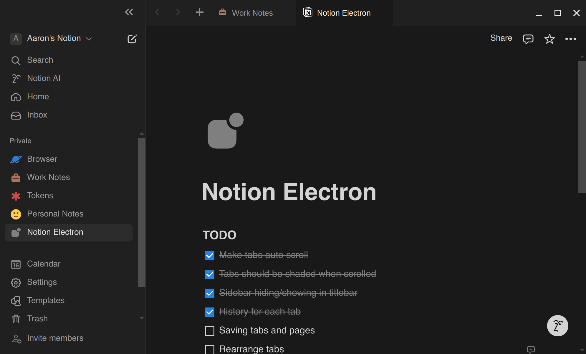

# Notion Electron – Unofficial Notion Client for Linux

Notion Electron is an unofficial desktop application for Notion, built using Electron. This project aims to provide a seamless and native-like experience for Notion users on desktop Linux (tested on Fedora 41). This app includes dedicated tabs for Notion Calendar and Notion Mail.

[](https://deepwiki.com/anechunaev/notion-electron)



## Installation

### [](https://github.com/anechunaev/notion-electron/releases/download/v1.7.10/notion-electron-1.7.10.x86_64.AppImage)

- **[Ubuntu / Debian `.deb` package (x64)](https://github.com/anechunaev/notion-electron/releases/download/v1.7.10/notion-electron-1.7.10.amd64.deb)**
- **[Fedora / CentOS / OpenSUSE `.rpm` package (x64)](https://github.com/anechunaev/notion-electron/releases/download/v1.7.10/notion-electron-1.7.10.x86_64.rpm)**
- **[Any Distribution `.AppImage` (x64)](https://github.com/anechunaev/notion-electron/releases/download/v1.7.10/notion-electron-1.7.10.x86_64.AppImage)**

### Manual Installation

You could also build an application from source files manually.

Dependencies:

- Node.js (v22 or higher)
- npm (v10 or higher)

Steps:

1. Clone the repository:
	```sh
	git clone https://github.com/anechunaev/notion-electron.git /usr/share/notion-electron
	```
2. Install dependencies:
	```sh
	npm install
	```
3. Build the application:
	```sh
	npm run make
	```
4. Install the application:
	```sh
	npm run install-desktop-file
	```

## Configuration

Run program with this flags to enable features:

- `--hide-on-startup` – This flag allows the application to start without opening the main window. It is useful when you add the client to your autostart programs list, since it will launch minimized to the tray.
- `--disable-spellcheck` - disables OS-defined spellcheck.

## Contributing

Contributions are welcome! Please follow these steps to contribute:

1. Fork the repository.
2. Create a new branch (`git checkout -b feature-branch`).
3. Make your changes.
4. Commit your changes (`git commit -m 'Add some feature'`).
5. Push to the branch (`git push origin feature-branch`).
6. Open a pull request.

## License

This project is licensed under the MIT License.

## Acknowledgements

- [Electron](https://www.electronjs.org/)
- [Notion](https://www.notion.so/)
